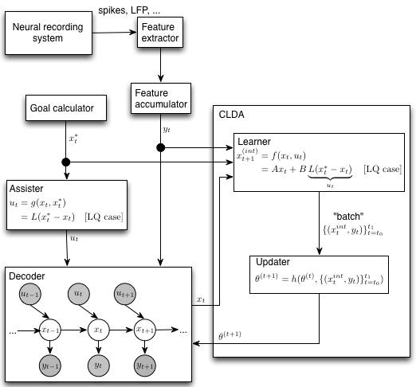

.. _bmi

Brain-machine interface (BMI) code
==================================

Architecure of BMILoop
----------------------
``BMILoop`` is the top-level interface for just running a BMI prosthesis, without any particular task structure. (Alternatively, you might oxymoronically call this an "unstructured task" if you are a neuroscientist). It's comprised of many smaller components, including machinery to adapt the decoder in closed-loop (CLDA), assistive shared control, and the interaction with the device itself.

In our BMI architecture, we enforce a separation between the "decoder" and the "plant". This distinction is vacuous for a virtual plant (e.g., a cursor on a screen) where the state of the plant is purely software controlled. However, the distinction is important for a physically actuated plant. Not every position commanded by a linear decoder can be physically achieved by a robot (or is safe to the subject), and movement between two different position states will require some actuation delay. Thus, modularity for different robotic control/guidance methods was prioritized, with the expense of a slightly more complex than necessary interface for virtual "plants". 

The major sub-components of the BMILoop are:

:doc:`extractor`
This first step in the loop processes "raw" data from the neural recording system (e.g., spikes, field potentials). Features extracted are typically simple features (number of event counts for spikes, bands in a set of frequency bands for LFP). Feature extractor classes are located in ``riglib.bmi.extractor``. The extractor class and configuration parameters are stored in the Decoder object as decoders are seeded/calibrated for a particular type of feature extractor (``extractor_cls`` and ``extractor_kwargs`` attributes).

**Feature accumulator**
(Note: the formalism for this module is still in progress!)
Features must sometimes be combined across time. For instance, for spike BMIs, the BMI loop may run at 60 Hz to match the display rate, but the decoder may expect to get a new observation only at 10 Hz. Thus some rate matching must be applied (specifically in this case, 6 observations must be added together). This operation may be different across decoder types. For instance, for LFP decoders where the feature extractor always outputs a power estimate for the last 200ms, the proper operation is simply downsampling to match from the iteration rate of the task to the observation rate of the decoder.

:doc:`decoder`
This is the core workhorse of the system, inferring the intended plant state x_t from observations y_t (and possibly combined with shared control u_t)

**Goal calculator**
For assistive control and CLDA (see below), it may be necessary to specify the ``target_state`` $x_t^*$. The target state is specified entirely by the task, i.e., completely independently of the decoder.

**Assister**
Generates a shared control vector u_t to be combined with the neural control component produced by the Decoder. This is sometimes used when starting the decoder parameters from adverse conditions, where you stil want the decoder (temporarily) to have a shared machine control component in order to span the control space as the Decoder improves.

**Closed-loop decoder adaptation (CLDA)**
Closed-loop decoder adaptation (CLDA) can be used to retune the parameters of a Decoder while the subject operates the prosthesis in real time. The CLDA block consists of two sub-blocks, the ``Learner`` and the ``Updater``. 

*Learner*
From task goals or otherwise, estimate the instantaneous *intended* next state $x_t^{int}$ from target state $x_t^*$. The output of this block is to periodically produce *batches* of pairs of intended kinematics and neural observations \lbrace(x_t^{int}, y_t)\rbrace_{t=t_0}^{t_1} which are then used by the updater to update the decoder parameters $\theta$. 

*Updater*
The updater implements an update rule to combine update the decoder parameters $\theta$ using an update rule on the old parameters and the batch produced by the learner. 

Plant interface
---------------
A unified plant interface is, at present, lacking. Most plants used in the software to date inherit from the module ``riglib.plants``, including the cursor, planar kinematic chains, and active upper-arm exoskeleton. A separate interface currently exists (not in this repository) for an exo where sensor feedback is streamed continuously rather than being polled on demand. The two cases are different since if sensor feedback is continuously streamed, a separate asynchronous process is required to collect and save the data, similar to the streamed neural data. 

.. autoclass:: riglib.plants.Plant
	:members: drive

Initializing a Decoder
----------------------
There are at least two contexts in which one would need to "train" (as opposed to "re-train" or "adapt") a Decoder. The first is to create an entirely new set of Decoder parameters from a "seeding" session. For instance, it is common to create a new decoder based on the neural response to subjects watching cursor movements without any control over the cursor (i.e. a "visual feedback" task). A second case where one would want to create a new Decoder object might be to do a "batch" recalibration [Gilja2012]_. 

Functions to train new decoder objects are in the module ``riglib.bmi.train``.

When using the browser interface, several files are involved in the machinery of creating a new Decoder:

db/tracker/namelist.py
	The possible configuration parameters (algorithm, plant, state space, etc.)
db/tracker/views.py

db/html/templates/bmi.html
	Handles the UI display of the BMI training sub-GUI. This only shows up for tasks which have the 'is_bmi_seed' class attribute as True
db/html/static/resources/js/bmi.js
	
db/tracker/ajax.py
	Handles the form submission from the BMI training sub-GUI
db/trainbmi.py
	..  automodule:: db.trainbmi
riglib/bmi/train.py
	..  automodule:: riglib.bmi.train

CLDA
----

**Learner**

The Learner is an object which estimates the "intention" of the subject performing the task. 

.. autoclass:: riglib.bmi.clda.Learner
	:members: __init__

The learner can be configured to run in trial-based mode, a time-based mode, or some combination of the two. This must be specified when the object is instantiated, using the batch_size, done_states and reset_states. For instance, with the BMIControlMulti task state machine, we can configure the learner to operate in a purely time based mode by specifying::
	
	done_states = []
	reset_states = []
	batch_size = N

or in a purely trial-based mode by specifying::

	done_states = ['reward', 'hold_penalty']
	reset_states = ['timeout_penalty']
	batch_size = np.inf

Simulating BMI
--------------
Simulations can be a useful tool for BMI design. Experimental evidence suggests that the offline accuracy of linear decoders often does not translate to good closed-loop control (e.g., [Koyama2010]_, [Ganguly_2010]_). This is perhaps due to the inherent feedback differences between BMI control during which the subject only has visual feedback, unlike arm control during which congruent proprioceptive feedback is also available. Furthermore, BMIs require the brain to solve a control problem that is different from the problem of controlling the natural arm because (1) the dynamics of the BMI plant are different from arm dynamics and (2) the BMI is controlled using a different neural pathway than the natural arm control mechanism. Therefore, we use simulations to compare the performance of different decoding algorithms instead of comparisons of offline reconstruction accuracy.

BMI simulation involve the the "task" program as well as the BMI software. After installing the
software, control of a 2D cursor can be simulated by running the script::

	run $HOME/code/bmi3d/tests/sim_clda/sim_clda_multi.py --alg=RML

where RML is an example of a CLDA algorithm that can be simulated using the script. The basic premise
behind all of the implemented simulations (as of May 2014) is that the spike rates/time-stamps of 
a population of neurons as a response to the stimulus of "intended" BMI state change, or intended
kinematics. Intention is simulated as a feedback controller. (see riglib.bmi.feedback_controllers
for examples). 

.. [Gilja2012] V. Gilja*, P. Nuyujukian*, C. A. Chestek, J. P. Cunningham, B. M. Yu, J. M. Fan, M. M. Churchland, M. T. Kaufman, J. C. Kao, S. I. Ryu, and K. V. Shenoy, “A high-performance neural prosthesis enabled by control algorithm design,” Nature Neuroscience, vol. 15, no. 12, pp. 1752–1757, Nov. 2012.

.. [Koyama2010] Koyama S., Chase S. M., Whitford A. S., Velliste M., Schwartz A. B., and Kass R. E. Comparison of brain-computer interface decoding algorithms in open-loop and closed-loop control. J. Comput. Neurosci., 29(1-2):73–87, August 2010.

.. [Ganguly2010] Ganguly K. and Carmena J. M. Neural Correlates of Skill Acquisition with a Cortical Brain-Machine Interface. Journal of Motor Behavior, (September 2012):37–41, 2010   